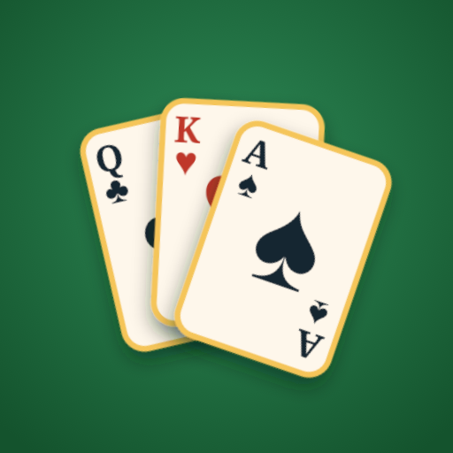
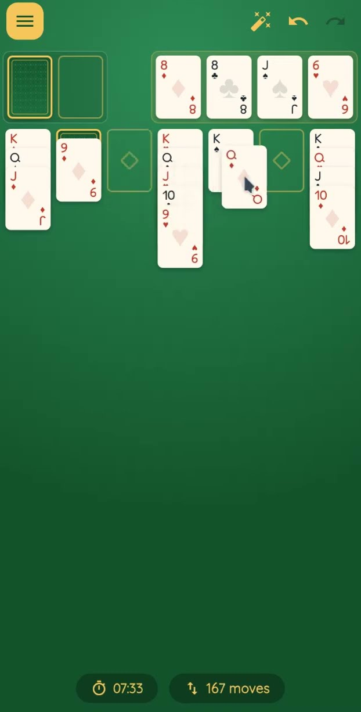
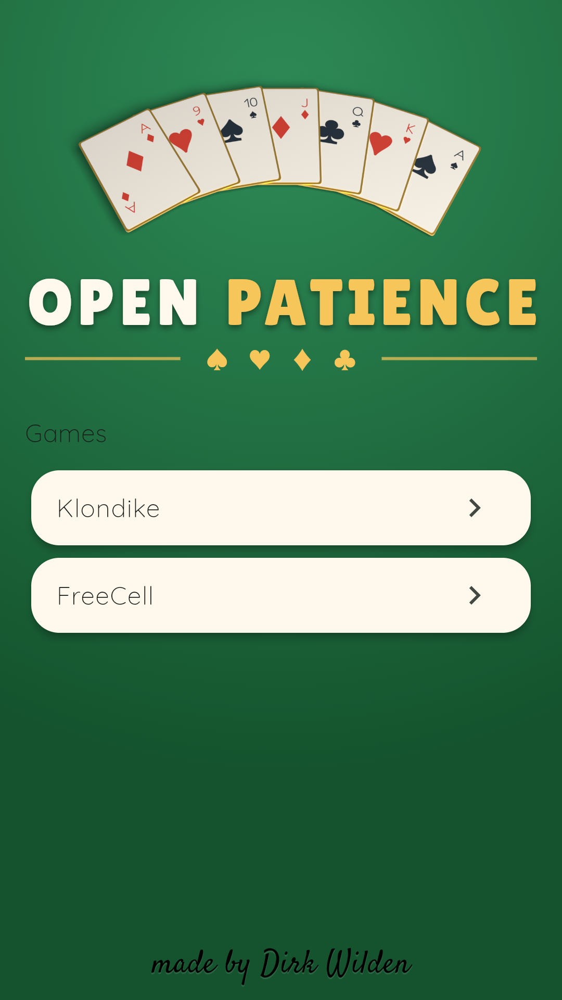
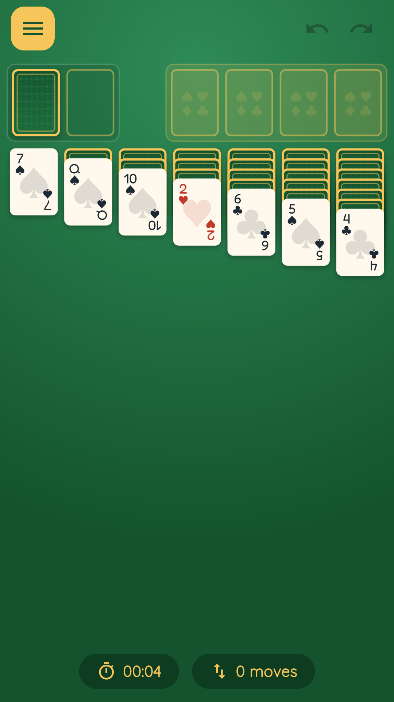
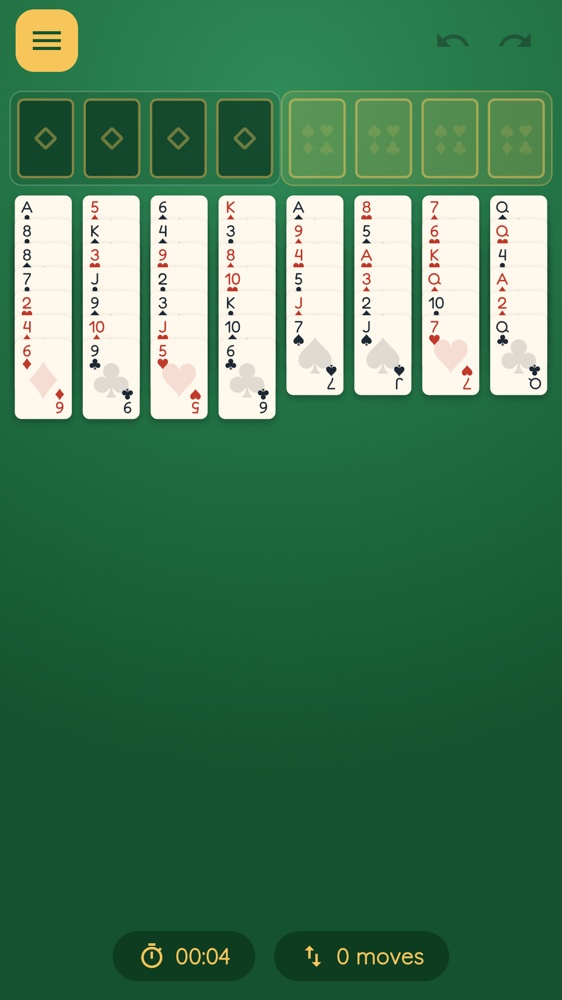

<div align="center">



# Open Patience

**A free, open-source solitaire game for Android — no ads, no tracking, no network.**

[](LICENSE)
[](https://github.com/d-rk/open-patience/actions/workflows/ci.yml)
[](https://github.com/d-rk/open-patience/releases/latest)

</div>

## See it play

<!-- Poster frame pulled from YouTube's own thumbnail render
     (oardefault.jpg) -- see tools/video/ for how the demo save was seeded. -->
<div align="center">

[](https://youtube.com/shorts/ROFZ-E9qmgQ)

**[▶ Watch the 30-second gameplay video](https://youtube.com/shorts/ROFZ-E9qmgQ)**

</div>

## Screenshots

<table>
<tr>
<td align="center"><br>Pick a game</td>
<td align="center"><br>Klondike — stock, four foundations, seven columns</td>
<td align="center"><br>FreeCell — four free cells, eight columns</td>
</tr>
</table>

## Features

- **Klondike** — draw one card at a time, or three.
- **FreeCell** — the classic four free cells, plus a tighter two-cell and a
  roomier six-cell variant.
- **One-tap auto-solve** — the button appears only once the board can actually
  be run out to the foundations, then plays the cascade for you.
- **Per-variant records** — total wins plus a top-ten leaderboard of your
  fastest runs, ties broken by fewer moves.
- **Resume where you left off** — the in-progress deal is saved and restored.
- **Genuinely offline** — the release build declares no Android permissions at
  all. No ads, no tracking, no network.

## Install

**GitHub Releases**: install an APK from
[the latest release](https://github.com/d-rk/open-patience/releases/latest).

**F-Droid**: Open Patience will be available on the main F-Droid repository once
[the corresponding Merge Request](https://gitlab.com/fdroid/fdroiddata/-/merge_requests/46901) is merged.


## Development

```bash
flutter pub get      # install dependencies
flutter analyze      # static analysis
flutter test         # unit + widget suite
flutter run --flavor production   # run the app locally
```

Full contributor guidance — architecture, TDD workflow, style — is in
[`CLAUDE.md`](CLAUDE.md) and [`CONTRIBUTING.md`](CONTRIBUTING.md). Release
process: [`RELEASING.md`](RELEASING.md).

## License

Open Patience is free software licensed under the **GNU Affero General
Public License v3.0** (AGPL-3.0-only) — see [`LICENSE`](LICENSE). You are
free to use, study, share and modify it; if you run a modified version as a
network service, the AGPL requires you to offer that version's source to its
users.
